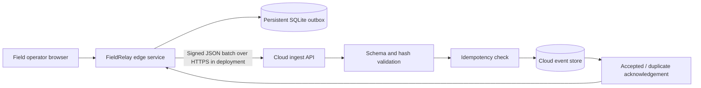

# FieldRelay Architecture

## System boundary

## Components

| Component | Responsibility | Failure behavior |
|---|---|---|
| Edge console | Captures operational records and displays sync state | Continues accepting records while the uplink is marked unavailable |
| SQLite outbox | Persists each event before sending it | Records remain pending across process restarts |
| Batch sender | Selects ready records and sends groups of up to 50 | Uses bounded exponential retry delay after a failed attempt |
| Request authentication | HMAC-SHA256 over the exact serialized batch body | Rejects missing or invalid signatures |
| Cloud ingest API | Validates schema and per-event digest before writing | Rejects malformed, altered, or conflicting records |
| Event store | Stores events under a unique event ID | Identical replays are acknowledged without inserting a second row |
| Dead-letter state | Stops retrying a repeatedly failing record | Leaves the record visible for manual review |

## Event envelope

Each event contains `event_id`, `site_code`, `event_type`, `created_at`, `payload`, and `event_sha256`. The digest covers the canonical serialized event core. The request signature covers the serialized batch. The service recalculates each event digest before opening a database transaction.

## Synchronization sequence

1. Validate the operator's input and write an event to the local SQLite outbox.
2. Select up to 50 pending events whose retry time has passed.
3. Serialize the batch deterministically and sign the exact request body with the shared HMAC key.
4. Submit the batch to the cloud ingest endpoint.
5. The cloud service validates the signature, event schema, content hashes, and event ID uniqueness.
6. The service commits new event IDs and returns separate accepted and duplicate lists.
7. The edge outbox marks only acknowledged IDs as synced. A failed batch remains queued and receives a retry schedule.

## Deployment notes

The Compose setup runs an edge console and a cloud API in separate containers with separate persistent volumes. For deployment beyond a demonstration, terminate TLS at a managed gateway, store the shared key in a secret manager, restrict network access to the ingest endpoint, set retention and backup policies, monitor queue depth, and replace the SQLite cloud store with a managed relational database or durable queue as concurrency grows.

## Current limits

The demo's offline switch simulates an unavailable uplink at the client. The browser and edge service still require access to the edge service itself. The prototype uses a single shared HMAC secret, SQLite, and manual sync initiation; it does not implement key rotation, multi-tenant authorization, automatic background sync, or distributed conflict resolution. The hash detects modification relative to the signed request, but does not encrypt stored event payloads.
