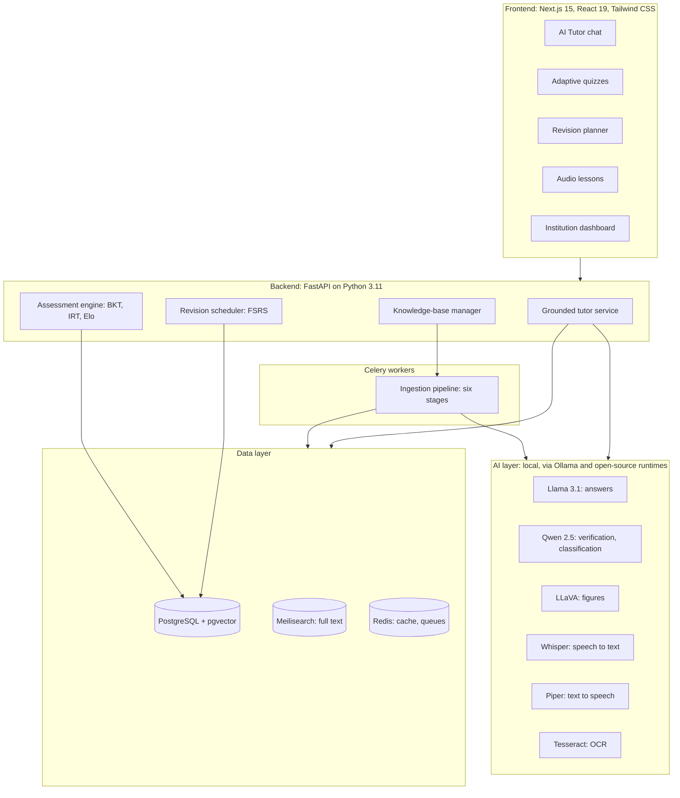

# IntelliNova: A Source-Grounded, Adaptive Study Companion Built on Locally Hosted Language Models

**3SVK Research Series, Season 3: Proceedings**

**Nitish Gautam**

Bachelor of Science in Artificial Intelligence and Machine Learning

Indian Institute of Information Technology Vadodara (IIIT Vadodara), Gujarat, India

*Tagline: A study companion that teaches only from your class material.*

---

## Abstract

Students today learn from a scattered mix of textbooks, slides, lecture recordings and general-purpose AI chatbots. Chatbots answer fluently but can state incorrect facts with confidence, do not follow the syllabus a student is actually taught, and usually send student data to external cloud services. We present **IntelliNova**, an educational platform that turns an institution's own learning resources into a source-grounded tutor, an adaptive assessment engine and a personalised revision planner. IntelliNova ingests textbooks, presentations, scanned notes and lecture recordings through a six-stage pipeline (OCR and speech transcription, figure analysis, segmentation, topic classification, topic discovery, and hybrid indexing). It answers questions only from this approved material, attaching a verifiable citation to each claim: a page, a slide, a figure or a lecture timestamp. A faithfulness check verifies each answer before it is shown, and the system declines questions that the material does not cover. Learner modelling combines Bayesian Knowledge Tracing (BKT) for topic mastery, Item Response Theory (IRT) for ability estimation and item selection, Elo-based difficulty calibration for new questions, and the Free Spaced Repetition Scheduler (FSRS) for revision timing. All models (Llama 3.1, Qwen 2.5, LLaVA, Whisper, Piper and Tesseract) run locally through Ollama and related open-source runtimes, so the system works fully offline and student data never leaves the institution. We describe the architecture, the grounding and learner-modelling methods, and an evaluation protocol with target thresholds: faithfulness ≥ 85%, context precision and recall ≥ 80%, citation accuracy ≥ 85%, and off-material detection accuracy ≥ 90%.

**Keywords:** Artificial Intelligence, Educational Technology, Retrieval-Augmented Generation, Adaptive Learning, Knowledge Tracing, Item Response Theory, Spaced Repetition, Learning Analytics, Explainable AI, Local LLMs, Personalised Education, EdTech

---

## 1. Introduction

Large language models (LLMs) have made conversational tutoring widely accessible, but three properties limit their use in formal education.

1. **Unreliable facts.** LLMs can produce fluent statements that are unsupported or false, a behaviour widely described as hallucination [7]. A student usually cannot tell a correct answer from a plausible wrong one.
2. **No curriculum alignment.** A general model answers from its pre-training data, not from the textbook, notation and scope used in a particular course. Its answers may be correct in general but inconsistent with what the student will be examined on.
3. **Privacy and cost.** Most AI tutors call commercial cloud APIs. This creates a recurring per-query cost and sends student questions, mistakes and learning histories to third parties.

Learning tools have further gaps. Knowledge is spread across many resources, so students spend time searching instead of learning. Fixed question banks do not adapt to what a learner already knows. Revision is usually planned by hand, even though decades of research show that spaced, retrieval-based practice improves long-term retention [10, 11]. Finally, many learners in India are more comfortable in Hindi or Hinglish than in English.

IntelliNova addresses these gaps with one design principle: **the institution's approved material is the only source of truth.** Every answer is retrieved from that material, cited to an exact location, checked for faithfulness, and withheld when the material does not support it. On top of this grounded knowledge base, IntelliNova models each learner's mastery and memory to decide what to ask next and when to revise.

**Contributions.** This paper makes four contributions:

- an end-to-end, offline architecture that turns heterogeneous course material (scanned PDFs, slides, figures, lecture audio) into a citable, topic-structured knowledge base;
- a grounded tutoring protocol with claim-level citations, faithfulness verification and explicit abstention on off-material questions;
- an integrated learner model in which BKT, IRT, Elo and FSRS each handle a distinct part of adaptive practice;
- an evaluation protocol with measurable targets for answer reliability, retrieval quality, citation accuracy and off-material detection.

The rest of the paper is organised as follows. Section 2 reviews related work. Section 3 presents the architecture. Section 4 describes knowledge processing, Section 5 the grounded tutor, and Section 6 the adaptive assessment engine. Section 7 covers implementation and privacy, Section 8 the evaluation protocol, Section 9 applications, Section 10 limitations, and Section 11 future work. Section 12 concludes.

---

## 2. Related Work

**Retrieval-augmented generation.** Retrieval-augmented generation (RAG) conditions a language model on passages retrieved from an external corpus, improving factuality on knowledge-intensive tasks and making answers traceable to sources [1]. Hybrid retrieval, which combines lexical ranking such as BM25 [12] with dense vector similarity and merges the results with reciprocal rank fusion [13], is robust across query types. Reference-free metrics such as faithfulness, context precision and context recall have been proposed to evaluate RAG pipelines [6]. IntelliNova applies these ideas to a closed, curriculum-bounded corpus with fine-grained citations to pages, slides and timestamps.

**Knowledge tracing.** Bayesian Knowledge Tracing models a learner's mastery of each skill as a hidden binary state updated after every answer [2]. It remains widely used because it is simple and its parameters are interpretable.

**Item response theory and Elo.** IRT models the probability of a correct response as a function of learner ability and item parameters such as difficulty and discrimination [3]. It underpins computerised adaptive testing, in which the next item is the one that is most informative at the learner's current ability estimate. Elo rating, originally developed for chess [4], has been adapted to education as a lightweight online estimator of learner ability and item difficulty that needs no batch calibration [5].

**Spaced repetition.** The forgetting curve [10] and the testing effect [11] motivate scheduling reviews just before an item would be forgotten. FSRS models memory with difficulty, stability and retrievability and optimises review intervals from review logs [8].

**Local models.** Open-weight models such as Llama 3 [14] and Qwen 2.5 [15], multimodal models such as LLaVA [16], speech recognition with Whisper [9] and OCR with Tesseract [17] can now run on commodity hardware. This makes fully on-premise educational AI practical.

Most existing systems address one of these areas in isolation. IntelliNova combines grounded generation, learner modelling and local deployment in a single pipeline, built around one institution-owned knowledge base.

---

## 3. System Architecture

IntelliNova is a set of containerised services deployed with Docker Compose on local infrastructure. 
-It runs fully offline.

**Table 1. Technology stack.**

| Layer | Components | Role |
|---|---|---|
| Frontend | Next.js 15, React 19, Tailwind CSS | Tutor chat, quizzes, revision planner, dashboards |
| Backend | FastAPI, Python 3.11, Celery workers | APIs, learner modelling, background ingestion |
| Data | PostgreSQL, pgvector, Redis, Meilisearch | Relational data, vector index, cache and queues, full-text index |
| AI | Ollama with Llama 3.1 and Qwen 2.5; LLaVA; Whisper; Piper; Tesseract OCR | Generation, verification, figure understanding, speech in and out, OCR |
| Deployment | Docker Compose | Single-command, on-premise deployment with no internet dependency |

---

## 4. Knowledge Processing Framework

Instructors or administrators upload approved resources: textbooks, slide decks, scanned notes, images and lecture recordings. A six-stage pipeline, run as background Celery jobs, turns them into a citable knowledge base.

**Stage 1: OCR and speech transcription.** Text-layer PDFs are parsed directly. Scanned pages and images go through Tesseract OCR. Lecture audio is transcribed with Whisper, keeping segment-level timestamps. Every text span keeps its *provenance*: document identifier, page or slide number, bounding region, or start and end time.

**Stage 2: Diagram and figure analysis.** Figures, charts and diagrams are detected and described by a multimodal model (LLaVA). The description is stored as a figure chunk linked to its page and figure number, so figure content becomes searchable and citable.

**Stage 3: Content segmentation.** Text is split into chunks along structural boundaries (sections, slides, paragraphs, transcript pauses), with a bounded length and a small overlap. Each chunk inherits the provenance of its source span, which makes page-, slide- and timestamp-level citations possible.

**Stage 4: Topic classification.** Each chunk is assigned to a node in a course topic hierarchy (topic, sub-topic, concept), and prerequisite links between concepts are recorded. This topic graph is shared by the tutor (for scope checks) and the learner model (for mastery tracking).

**Stage 5: Topic discovery.** Chunks that do not fit any existing node with sufficient confidence are clustered, and candidate new concepts are proposed for instructor review. This keeps the topic graph complete as new material is added.

**Stage 6: Indexing.** Each chunk is embedded and stored in pgvector for semantic search, and indexed in Meilisearch for exact-term search. Exact-term search matters for formulas, symbols and technical vocabulary.

---

## 5. Core Module 1: The Grounded AI Tutor

### 5.1 Retrieval-augmented learning workflow

Each question follows a seven-step protocol, all inside the local deployment:

1. **Query submission.** The learner asks in English, Hindi or Hinglish, by text or voice. Voice questions are transcribed by Whisper.
2. **Query analysis.** The query is normalised (for example, Hinglish is mapped to course terminology), the conversation context is resolved, and the query is mapped to candidate topics.
3. **Hybrid retrieval.** Semantic (pgvector) and lexical (Meilisearch) searches run in parallel, restricted to the learner's enrolled course material.
4. **Ranking and validation.** Results are merged with reciprocal rank fusion [13]:

   $$\mathrm{RRF}(d) = \sum_{r \in R} \frac{1}{k + \mathrm{rank}_r(d)}, \qquad k = 60$$

   where $R$ is the set of rankers. The top chunks are then re-ranked and filtered by a relevance threshold.
5. **Grounded generation.** The local LLM is instructed to answer *only* from the supplied chunks and to attach a citation marker to every factual claim.
6. **Faithfulness verification.** The answer is decomposed into atomic claims. A verifier model checks whether each claim is entailed by its cited chunk. The faithfulness score is

   $$F = \frac{\lvert \{\text{claims supported by cited context}\} \rvert}{\lvert \{\text{all claims}\} \rvert}$$

   Unsupported claims are removed or regenerated. If $F$ stays below a threshold $\tau_F$, the tutor gives a partial answer and says what the material does not cover.
7. **Delivery with citations.** The final answer shows citations that open the exact source location: the page, the slide, the figure, or the lecture recording at the cited timestamp.

### 5.2 Curriculum boundaries and off-material detection

A question is classified as **off-material** when no retrieved chunk passes the relevance threshold, when the query falls outside the course topic graph, or when no faithful answer can be produced. In that case the tutor states that the question is not covered by the course material and does not answer from the model's general knowledge. This explicit abstention keeps answers inside the curriculum and prevents unsupported answers.

### 5.3 Language support

The tutor accepts and answers in **English, Hindi and Hinglish**. Retrieval runs on normalised course terminology, so a Hinglish question can match English source text. Citations always point to the original source, so the learner can check the answer in the original wording.

### 5.4 Expected benefits

Grounding answers in approved material and abstaining when support is missing is designed to **sharply reduce** hallucinated content, align explanations with the syllabus, and make every answer transparently verifiable by the learner and the instructor.

---

## 6. Core Module 2: The Adaptive Assessment Engine

The engine uses four complementary models. Each one answers a different question about the learner.

**Table 2. Roles of the learner models.**

| Model | Question it answers | Granularity |
|---|---|---|
| Bayesian Knowledge Tracing | Has the learner mastered this concept? | Per learner, per concept |
| Item Response Theory | What is the learner's ability, and which question is most informative now? | Per learner (ability), per item (parameters) |
| Elo rating | How hard is a new question, before enough data exists for IRT? | Per item, updated online |
| FSRS | When should this concept be revised? | Per learner, per concept or card |

### 6.1 Bayesian Knowledge Tracing

For each concept, BKT maintains $P(L_t)$, the probability that the learner has mastered it, with guess $g$, slip $s$ and learning-transition $T$ parameters [2]. After a correct response:

$$P(L_t \mid \text{correct}) = \frac{P(L_t)(1-s)}{P(L_t)(1-s) + (1-P(L_t))\,g}$$

After an incorrect response:

$$P(L_t \mid \text{incorrect}) = \frac{P(L_t)\,s}{P(L_t)\,s + (1-P(L_t))(1-g)}$$

The posterior then accounts for learning during the step:

$$P(L_{t+1}) = P(L_t \mid \text{obs}) + \bigl(1 - P(L_t \mid \text{obs})\bigr)\,T$$

A concept is marked mastered when $P(L) \ge 0.95$. Mastery estimates propagate along the prerequisite graph from Stage 4: a learner who struggles with a concept is directed to unmastered prerequisites for targeted remediation.

### 6.2 Item Response Theory

Each item $i$ has discrimination $a_i$, difficulty $b_i$ and guessing $c_i$. The three-parameter logistic model gives the probability that a learner with ability $\theta$ answers correctly [3]:

$$P_i(\theta) = c_i + \frac{1 - c_i}{1 + e^{-a_i(\theta - b_i)}}$$

Ability is re-estimated after each response. Within the topic chosen by the learner model, the next item maximises Fisher information at the current ability estimate. Under the two-parameter case ($c_i = 0$) this is:

$$I_i(\theta) = a_i^2\,P_i(\theta)\bigl(1 - P_i(\theta)\bigr)$$

This gives personalised quizzes that are neither too easy nor too hard, and it reduces repeated questions.

### 6.3 Elo-based difficulty estimation

Newly generated or newly added questions have no calibration data. Following the educational adaptation of Elo [4, 5], after a learner with ability $\theta$ answers an item with difficulty $b$:

$$E = \frac{1}{1 + e^{-(\theta - b)}}, \qquad \theta \leftarrow \theta + K\,(r - E), \qquad b \leftarrow b - K\,(r - E)$$

where $r \in \{0, 1\}$ is the outcome and $K$ is a step size that decreases as an item collects responses. Once an item has enough responses, its Elo difficulty initialises its IRT calibration.

### 6.4 FSRS spaced repetition

FSRS models each memory with difficulty $D$, stability $S$ (in days) and retrievability $R$ [8]. Retrievability after $t$ days follows a power forgetting curve:

$$R(t, S) = \left(1 + F\,\frac{t}{S}\right)^{C}, \qquad F = \tfrac{19}{81},\; C = -0.5$$

These constants are chosen so that $R(S, S) = 0.9$. For a target retention $r$, the next review interval is:

$$I(r, S) = \frac{S}{F}\left(r^{1/C} - 1\right)$$

so $I = S$ when $r = 0.9$. After each review, $D$ and $S$ are updated from the rating, and FSRS parameters can be fitted to the institution's own review logs. The revision planner combines FSRS due dates with BKT mastery and exam dates to build a daily plan that prioritises concepts close to being forgotten.

### 6.5 Outcomes

Together, these models provide personalised quizzes, better retention through timely revision, fewer repeated questions, targeted remediation through prerequisite links, and better assessment quality through calibrated item parameters.

---

## 7. Implementation, Privacy and Accessibility

**Local inference.** Llama 3.1 generates tutor answers. Qwen 2.5 performs claim verification and topic classification. LLaVA describes figures. All three are served through Ollama. Whisper (speech to text), Piper (text to speech) and Tesseract (OCR) run as local services. No external AI API is called at any stage.

**Privacy by design.** Course material, learner questions, responses and mastery data stay in the institution's PostgreSQL database. Because inference is local, the platform has no per-query API cost and can run in classrooms without reliable internet access.

**Audio learning assistant.** Piper converts answers and revision summaries into speech, so learners can study by listening. Whisper enables spoken questions.

**Institutional analytics.** An analytics dashboard aggregates mastery by topic, common misconceptions and revision adherence. This helps instructors decide what to re-teach.

---

## 8. Evaluation Protocol and Performance Targets

### 8.1 Benchmark construction

For each pilot course we will build a benchmark with instructors. It will contain (a) *in-material* questions with reference answers and gold source locations (page, slide or timestamp), and (b) *off-material* questions that are related to the subject but not covered by the uploaded material. Questions will be written in English, Hindi and Hinglish.

### 8.2 Metrics and targets

**Table 3. Evaluation metrics and target thresholds.**

| # | Metric | Definition | Target |
|---|---|---|---|
| 1 | Faithfulness | Fraction of answer claims entailed by the cited context, $F$ in Section 5.1 [6] | ≥ 85% |
| 2a | Context precision | Fraction of retrieved chunks that are relevant to the question, weighted by rank [6] | ≥ 80% |
| 2b | Context recall | Fraction of the reference-answer content that is supported by the retrieved chunks [6] | ≥ 80% |
| 3 | Citation accuracy | Fraction of citations whose exact location (page, slide, figure or timestamp) actually supports the claim it is attached to | ≥ 85% |
| 4 | Off-material detection accuracy | Fraction of benchmark questions correctly classified as answerable or off-material | ≥ 90% |

The expected benefits are less misinformation and more trust in answers (metric 1), relevant retrieval and efficient study (metric 2), transparent and verifiable learning (metric 3), and curriculum-bound tutoring without unsupported answers (metric 4).

Off-material detection will also be reported as precision and recall on the off-material class. This separates two failure modes: wrongly refusing questions the material covers, and answering questions it does not cover.

### 8.3 Learning-outcome study

Beyond answer quality, a pilot study will compare learners using IntelliNova with a control group on pre-test and post-test scores and on delayed retention tests after several weeks. It will also measure calibration of the learner model: how well predicted correctness, from BKT and IRT, matches observed correctness on held-out responses, using AUC and log-loss.

*All figures in Table 3 are design targets. Results will be reported after the pilot evaluation.*

---

## 9. Applications

IntelliNova is designed for any setting where an organisation owns its learning content and needs trustworthy, private tutoring:

- schools and coaching institutes;
- universities;
- skill-development platforms;
- corporate learning and training systems;
- distance-education programmes.

---

## 10. Limitations

- **Grounding depends on source quality.** If the uploaded material is wrong or incomplete, grounded answers inherit those errors. Abstention covers missing content but not incorrect content.
- **OCR and transcription errors.** Poor scans, handwriting and noisy audio reduce extraction quality, which can affect retrieval and citation accuracy.
- **Verifier limits.** Automated faithfulness checks are themselves model-based and can misjudge subtle claims. They lower risk rather than eliminating it.
- **Cold start.** BKT, IRT and FSRS parameters need response data. Default parameters and Elo calibration are used until enough data accumulates.
- **Hardware.** Local inference with several models needs a GPU-equipped server, although smaller quantised models can reduce this requirement.

---

## 11. Future Scope

- teacher dashboards with intervention suggestions;
- integration with learning management systems (LMS);
- automated worksheet and practice-paper generation from the topic graph;
- richer multimodal tutoring over diagrams and handwritten work;
- mobile-first deployment;
- federated learning across institutions without sharing raw student data;
- predictive academic analytics for early identification of struggling learners.

---

## 12. Conclusion

IntelliNova is an educational platform that combines grounded generation, adaptive learning and privacy-preserving deployment. It restricts answers to approved course material, cites each claim to its exact source, checks faithfulness, and declines questions outside the material. This addresses the reliability and curriculum-alignment problems of general-purpose chatbots. BKT, IRT, Elo and FSRS together personalise what a learner practises and when they revise. Because every model runs locally, institutions keep full control of their content and their students' data. The framework shows how artificial intelligence can be integrated responsibly into education while keeping trust, personalisation and institutional control.

---

## References

[1] P. Lewis, E. Perez, A. Piktus, F. Petroni, V. Karpukhin, N. Goyal, H. Küttler, M. Lewis, W. Yih, T. Rocktäschel, S. Riedel and D. Kiela, "Retrieval-Augmented Generation for Knowledge-Intensive NLP Tasks," in *Advances in Neural Information Processing Systems (NeurIPS)*, 2020.

[2] A. T. Corbett and J. R. Anderson, "Knowledge Tracing: Modeling the Acquisition of Procedural Knowledge," *User Modeling and User-Adapted Interaction*, vol. 4, no. 4, pp. 253–278, 1994.

[3] F. M. Lord, *Applications of Item Response Theory to Practical Testing Problems*. Hillsdale, NJ: Lawrence Erlbaum Associates, 1980.

[4] A. E. Elo, *The Rating of Chessplayers, Past and Present*. New York: Arco Publishing, 1978.

[5] R. Pelánek, "Applications of the Elo Rating System in Adaptive Educational Systems," *Computers & Education*, vol. 98, pp. 169–179, 2016.

[6] S. Es, J. James, L. Espinosa-Anke and S. Schockaert, "RAGAS: Automated Evaluation of Retrieval Augmented Generation," in *Proceedings of the 18th Conference of the European Chapter of the Association for Computational Linguistics (EACL): System Demonstrations*, 2024.

[7] Z. Ji, N. Lee, R. Frieske, T. Yu, D. Su, Y. Xu, E. Ishii, Y. Bang, A. Madotto and P. Fung, "Survey of Hallucination in Natural Language Generation," *ACM Computing Surveys*, vol. 55, no. 12, 2023.

[8] J. Ye, J. Su and Y. Cao, "A Stochastic Shortest Path Algorithm for Optimizing Spaced Repetition Scheduling," in *Proceedings of the 28th ACM SIGKDD Conference on Knowledge Discovery and Data Mining*, 2022. See also the open-source FSRS project: https://github.com/open-spaced-repetition

[9] A. Radford, J. W. Kim, T. Xu, G. Brockman, C. McLeavey and I. Sutskever, "Robust Speech Recognition via Large-Scale Weak Supervision," in *Proceedings of the 40th International Conference on Machine Learning (ICML)*, 2023.

[10] H. Ebbinghaus, *Über das Gedächtnis* (*Memory: A Contribution to Experimental Psychology*). Leipzig: Duncker & Humblot, 1885.

[11] J. D. Karpicke and H. L. Roediger III, "The Critical Importance of Retrieval for Learning," *Science*, vol. 319, no. 5865, pp. 966–968, 2008.

[12] S. Robertson and H. Zaragoza, "The Probabilistic Relevance Framework: BM25 and Beyond," *Foundations and Trends in Information Retrieval*, vol. 3, no. 4, pp. 333–389, 2009.

[13] G. V. Cormack, C. L. A. Clarke and S. Büttcher, "Reciprocal Rank Fusion Outperforms Condorcet and Individual Rank Learning Methods," in *Proceedings of the 32nd International ACM SIGIR Conference on Research and Development in Information Retrieval*, 2009.

[14] A. Grattafiori et al. (Llama Team, AI @ Meta), "The Llama 3 Herd of Models," arXiv:2407.21783, 2024.

[15] Qwen Team, "Qwen2.5 Technical Report," arXiv:2412.15115, 2024.

[16] H. Liu, C. Li, Q. Wu and Y. J. Lee, "Visual Instruction Tuning," in *Advances in Neural Information Processing Systems (NeurIPS)*, 2023.

[17] R. Smith, "An Overview of the Tesseract OCR Engine," in *Proceedings of the 9th International Conference on Document Analysis and Recognition (ICDAR)*, 2007.

[18] Software: Ollama (https://ollama.com), pgvector (https://github.com/pgvector/pgvector), Meilisearch (https://www.meilisearch.com), Piper text-to-speech (https://github.com/rhasspy/piper), FastAPI (https://fastapi.tiangolo.com), Celery (https://docs.celeryq.dev).
